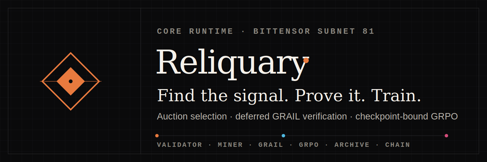
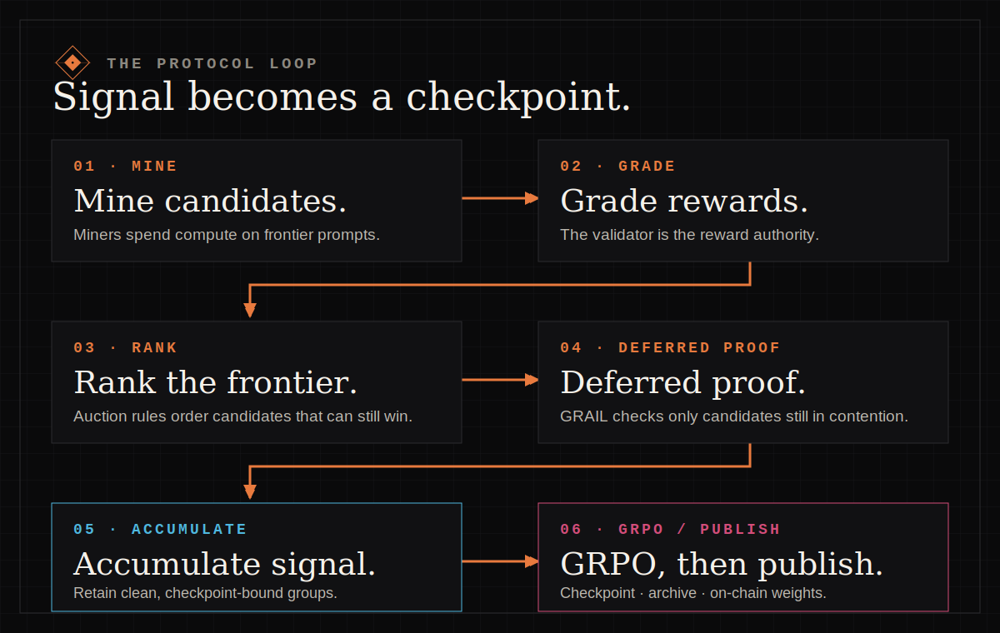

<p align="center">
  <a href="https://www.reliqua.ai">
    
  </a>
</p>

<p align="center">
  <strong>Verified frontier search for decentralized language-model training.</strong><br />
  Eight trajectories per prompt. Validator-authoritative rewards. Public evidence at every boundary.
</p>

<p align="center">
  <a href="https://github.com/reliquadotai/reliquary/actions/workflows/validator-tests.yml">
    
  </a>
  <a href="https://github.com/reliquadotai/reliquary/actions/workflows/cross-box-determinism.yml">
    
  </a>
  <a href="https://github.com/reliquadotai/reliquary/actions/workflows/docker-image.yml">
    
  </a>
  <a href="LICENSE.md">
    
  </a>
</p>

<p align="center">
  <a href="https://www.reliqua.ai/dashboard">Live dashboard</a>
  ·
  <a href="https://www.reliqua.ai/research">Research</a>
  ·
  <a href="https://huggingface.co/ReliquaryForge/qwen3.5-2b-reliquary-v3">Model</a>
  ·
  <a href="https://github.com/orgs/reliquadotai/packages/container/package/reliquary-validator">Container</a>
  ·
  <a href="docs/mining.md">Mine</a>
  ·
  <a href="docs/validating.md">Validate</a>
</p>

---

Reliquary is the open protocol and reference implementation for decentralized
GRPO training on Bittensor subnet 81. Independent miners spend their own GPU
compute searching for prompts at the policy's learning frontier. The trainer
admits, ranks, verifies, rewards, and—when the safety gates permit—trains on the
best groups.

The key incentive shift is simple: miners are not paid for producing the most
rollouts. They compete to contribute verified rollout groups the trainer can
use.

## The production loop

<p align="center">
  
</p>

1. **Collect.** Math and Code each accept candidates for a fixed 100-second
   interval. Every group contains exactly eight rollouts.
2. **Grade.** The validator recomputes Math rewards and executes Code cases in
   its sandbox. Groups below the reward-variance gate are rejected.
3. **Rank.** In-zone groups rank by
   `std(rewards) × (1 − mean(rewards))`, then validator-observed precommit
   round, then a post-deadline drand tie-break.
4. **Prove.** Economic proof runs top-down only for candidates that can still
   win. A bounded, unpaid non-winner sample is also proven for forensic
   telemetry and cannot affect the auction.
5. **Select and reward.** At most eight content-distinct groups win per
   environment. Each winner receives one uniform slot. There is no active
   runner-up split or per-operator winner cap; unfilled slots burn.
6. **Retain and train.** Clean winners accumulate under one exact public
   checkpoint until both environment targets are full. Quarantined selections
   remain archived and credited but never enter the optimizer.
7. **Publish.** Accepted optimizer steps produce a Hugging Face checkpoint. The
   default cadence is four trained steps, with an earlier safe publication when
   the behavior-policy drift gate requires it.

The normative mechanism and rejection semantics live in
[Concepts](docs/concepts.md). Historical design documents are evidence of how
the protocol evolved; they are not the production contract.

## What is live

| Layer | State |
| --- | --- |
| Auction v2, forced-sampling protocol v2, GRAIL verification | **Live** |
| Mixed OpenMath + OpenCode collection and validator-authoritative rewards | **Live** |
| Canonical prompt-content identity and one-shot cooldown | **Live** |
| Utility telemetry | **Live, observation only** |
| Behavior descriptors and a novelty archive | **Not deployed** |
| Novelty-shaped ranking, rewards, or training loss | **0% influence** |

The observation-only utility foundation does not alter admission, ranking,
selection, payout, or training. Its activation gates are documented in
[Auction v3 Utility Foundation](docs/auction-v3-utility-foundation.md).

## Trust and verification boundaries

Reliquary is auditable, but it is not currently trustless:

- The production trainer owns checkpoint publication and is authoritative for
  reward computation, selection, quarantine, and optimizer execution.
- GRAIL sketches, signed submissions, and validator recomputation provide
  evidence that selected rollouts match their announced checkpoint. They do
  not prove that the optimizer or the validator's policy is correct.
- A signed checkpoint manifest binds a checkpoint number to an immutable
  Hugging Face revision. It is an authenticated announcement, not a proof of
  every training transition.
- Weight-only validators replay the public archive into the scoring signal.
  Multi-trainer checkpoint consensus is not implemented.

These boundaries are intentional and explicit while the network bootstraps.
The dashboard, model revisions, window archives, and security reports expose
the evidence needed to evaluate them.

## Local development

The following matches the CPU environment used by the validator test workflow:

```bash
git clone https://github.com/reliquadotai/reliquary.git
cd reliquary

python3.12 -m venv .venv
source .venv/bin/activate
python -m pip install --upgrade pip
python -m pip install torch==2.7.0 \
  --index-url https://download.pytorch.org/whl/cpu
python -m pip install -e ".[dev]"

pytest -q \
  --ignore=tests/gpu \
  --ignore=tests/integration/test_grader_e2e.py \
  --disable-warnings
```

Mining and training require the pinned inference stack and suitable NVIDIA
hardware; the CPU setup above is for development and tests. Start with the
[miner guide](docs/mining.md) or [validator guide](docs/validating.md) before
running an operator workload.

## Documentation

| Guide | Purpose |
| --- | --- |
| [Concepts](docs/concepts.md) | Current mechanism, incentives, verification, and economics |
| [Mining](docs/mining.md) | Reference miner, submission lifecycle, hardware, and troubleshooting |
| [Validating](docs/validating.md) | Weight-only and trainer deployment |
| [Validator observability](docs/validator_observability.md) | Health, verdict, archive, and runtime evidence |
| [Auction v2 production contract](docs/superpowers/specs/2026-07-15-difficulty-auction-v2-design.md) | Detailed selector and payout contract |
| [Utility foundation](docs/auction-v3-utility-foundation.md) | Observation-only research surface and activation gates |
| [Security reports](docs/security/) | Incident chronology, hardening decisions, and operator evidence |

Project-wide policies:
[Contributing](https://github.com/reliquadotai/.github/blob/main/CONTRIBUTING.md)
· [Security](https://github.com/reliquadotai/.github/blob/main/SECURITY.md)
· [Support](https://github.com/reliquadotai/.github/blob/main/SUPPORT.md)

## License

Reliquary is available under the [MIT License](LICENSE.md).
