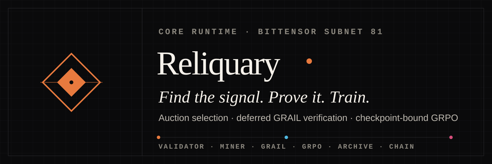
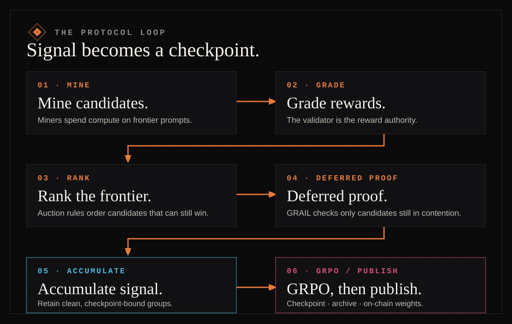

<p align="center">
  <a href="https://www.reliqua.ai">
    
  </a>
</p>

<p align="center">
  <strong>Verified frontier search for decentralized language-model training.</strong><br />
  Sixteen trajectories per prompt. Validator-authoritative rewards. Public evidence at every boundary.
</p>

<p align="center">
  <a href="https://github.com/reliquadotai/reliquary/actions/workflows/validator-tests.yml">
    
  </a>
  <a href="https://github.com/reliquadotai/reliquary/actions/workflows/cross-box-determinism.yml">
    
  </a>
  <a href="https://github.com/reliquadotai/reliquary/actions/workflows/docker-image.yml">
    
  </a>
  <a href="LICENSE.md">
    
  </a>
</p>

<p align="center">
  <a href="https://www.reliqua.ai/dashboard">Live dashboard</a>
  ·
  <a href="https://www.reliqua.ai/research">Research</a>
  ·
  <a href="https://huggingface.co/Qwen/Qwen3-4B-Base">Base model</a>
  ·
  <a href="https://github.com/orgs/reliquadotai/packages/container/package/reliquary-validator">Container</a>
  ·
  <a href="docs/mining.md">Mine</a>
  ·
  <a href="docs/validating.md">Validate</a>
</p>

---

Reliquary is the open protocol and reference implementation for decentralized
GRPO training on Bittensor subnet 81. Independent miners spend their own GPU
compute searching for prompts at the policy's learning frontier. The trainer
admits, ranks, verifies, rewards, and—when the safety gates permit—trains on the
best groups.

The key incentive shift is simple: miners are not paid for producing the most
rollouts. They compete to contribute verified rollout groups the trainer can
use.

## V1.0 miner migration

Adapt your existing miner deployment; no separate starter package is required.
Stop the old miner before starting V1 and preserve your registered hotkey,
miner state directory and Hugging Face cache.

Use the pinned miner image (the controller has additional server-only fixes):

```sh
docker pull ghcr.io/reliquadotai/reliquary-validator:sha-3b3af1d-logic@sha256:7bb847499605308b1ad7b21f5430b1662eae506deacb6899d682bc0c11ce2742
```

Set these variables **inside your existing miner service or container**:

```dotenv
RELIQUARY_PROTOCOL_PROFILE=qwen3-4b-base-dapo-reliquary-v1
RELIQUARY_EXPERIMENTAL_FILL_CLOSED_ENABLED=1
RELIQUARY_TRAINING_RUN_ID=qwen3-4b-base-dapo-reliquary-v1-20260910
```

Keep your existing GPU selection, wallet mounts and persistent state/cache
paths. Inside that configured environment, adapt your existing miner command:

```sh
reliquary mine \
  --network finney --netuid 81 \
  --wallet-name YOUR_EXISTING_WALLET \
  --hotkey YOUR_REGISTERED_HOTKEY \
  --wallet-path YOUR_EXISTING_WALLET_DIRECTORY \
  --validator-url http://62.238.81.36:8000 \
  --environments openmathinstruct,opencodeinstruct,reliquary_logic_v2
```

Choose any nonempty subset of **Math** (`openmathinstruct`), **Code**
(`opencodeinstruct`) and **Logic** (`reliquary_logic_v2`). Running all three is
optional. Use one miner process per hotkey/state directory.

Before starting, follow the current operator notice and check readiness:

```sh
curl --fail --silent --show-error --max-time 10 http://62.238.81.36:8000/readyz
curl --fail --silent --show-error --max-time 10 http://62.238.81.36:8000/state
```

A failed readiness check or HTTP 503 means keep the miner paused. This README
is configuration guidance, not a live GO notice. The initial V1 checkpoint is
**N1812**, repository `ReliquaryForge/qwen3-4b-base-dapo-v4`, revision
`6c3f02be8e720d3ccfd1bd320de8ea7f864a04e6`. Follow the validator's advertised
successor checkpoints automatically; do not permanently pin N1812 or delete
checkpoint identity records to bypass a mismatch.

V1 uses **fill-closed windows**. Follow the deadlines and phase in `/state`:
windows may close underfilled, and an upload acknowledgement is not a final
proof, selection or payment verdict. No extra controller bounded-service flag
is needed on miners. See [Mining](docs/mining.md) for the submission lifecycle.

Logic uses a pinned integration with the **Prime Intellect Verifiers format
for supported environment contracts**. This supports further integrations;
it does not certify every Prime environment.

## Legacy auction profile loop

The fixed-window values below describe the legacy auction profiles. For V1
configuration and fill-closed timing, use the migration instructions above and
the validator's advertised runtime state.

<p align="center">
  
</p>

1. **Collect.** Math and Code each accept up to 96 productive candidates. The
   100-second profile value is a hard ceiling; a GPU-aware quiet/drain check may
   close from 60 seconds onward, after the primary 64-candidate population.
   Every group contains exactly 16 rollouts.
2. **Grade.** The validator recomputes Math rewards and executes Code cases in
   its sandbox. Groups below the reward-variance gate are rejected.
3. **Rank.** In-zone groups rank by
   `std(rewards) × (1 − mean(rewards))`; equal values use a capped throughput
   bucket, then a post-seal drand tie-break. Validator-observed arrival is used
   once, as the throughput denominator, not again as a second speed preference.
4. **Prove.** Economic proof runs top-down only for candidates that can still
   win. A bounded, unpaid non-winner sample is also proven for forensic
   telemetry and cannot affect the auction.
5. **Select and reward.** At most 16 content-distinct groups win per
   environment. Each winner receives one uniform slot. There is no active
   runner-up split or per-operator winner cap; unfilled slots burn.
6. **Retain and train.** Clean winners accumulate under one exact public
   checkpoint until both environment targets are full. Quarantined selections
   remain archived and credited but never enter the optimizer.
7. **Publish.** Accepted optimizer steps produce a Hugging Face checkpoint. The
   default cadence is 16 trained steps, with an earlier safe publication when
   the behavior-policy drift gate requires it.

The normative mechanism and rejection semantics live in
[Concepts](docs/concepts.md). Historical design documents are evidence of how
the protocol evolved; they are not the production contract.

## Feature status

Runtime availability is reported by `/readyz`; this table is not a GO notice.

| Layer | State |
| --- | --- |
| V1 profile: fill-closed windows with Math, Code and Logic | Configuration above; follow operator notices and runtime readiness |
| Qwen3-4B Base DAPO reasoning-v5 profile, deferred-proof auction, and GRAIL verification | **Release candidate — runtime gates pending** |
| Mixed OpenMath + OpenCode collection and validator-authoritative rewards | **Live** |
| Canonical prompt-content identity and one-shot cooldown | **Live** |
| Utility telemetry | **Live, observation only** |
| Behavior descriptors and a novelty archive | **Not deployed** |
| Novelty-shaped ranking, rewards, or training loss | **0% influence** |

The observation-only utility foundation does not alter admission, ranking,
selection, payout, or training. Its activation gates are documented in
[Auction v3 Utility Foundation](docs/auction-v3-utility-foundation.md).
Change the v5 row to **Live** only at the coordinated runtime activation. See
the [reasoning-prompt v5 cutover](docs/reasoning-prompt-v5-cutover.md) for the
fresh-baseline and deployment gates.

## Trust and verification boundaries

Reliquary is auditable, but it is not currently trustless:

- The production trainer owns checkpoint publication and is authoritative for
  reward computation, selection, quarantine, and optimizer execution.
- GRAIL sketches, signed submissions, and validator recomputation provide
  evidence that selected rollouts match their announced checkpoint. They do
  not prove that the optimizer or the validator's policy is correct.
- A signed checkpoint manifest binds a checkpoint number to an immutable
  Hugging Face revision. It is an authenticated announcement, not a proof of
  every training transition.
- Weight-only validators replay the public archive into the scoring signal.
  Multi-trainer checkpoint consensus is not implemented.

These boundaries are intentional and explicit while the network bootstraps.
The dashboard, model revisions, window archives, and security reports expose
the evidence needed to evaluate them.

## Local development

The following matches the CPU environment used by the validator test workflow:

```bash
git clone https://github.com/reliquadotai/reliquary.git
cd reliquary

python3.12 -m venv .venv
source .venv/bin/activate
python -m pip install --upgrade pip
python -m pip install torch==2.7.0 \
  --index-url https://download.pytorch.org/whl/cpu
python -m pip install -e ".[dev]"

pytest -q \
  --ignore=tests/gpu \
  --ignore=tests/integration/test_grader_e2e.py \
  --disable-warnings
```

Mining and training require the pinned inference stack and suitable NVIDIA
hardware; the CPU setup above is for development and tests. Start with the
[miner guide](docs/mining.md) or [validator guide](docs/validating.md) before
running an operator workload.

## Documentation

| Guide | Purpose |
| --- | --- |
| [Concepts](docs/concepts.md) | Current mechanism, incentives, verification, and economics |
| [Mining](docs/mining.md) | Reference miner, submission lifecycle, hardware, and troubleshooting |
| [Validating](docs/validating.md) | Weight-only and trainer deployment |
| [Validator observability](docs/validator_observability.md) | Health, verdict, archive, and runtime evidence |
| [Historical auction-v2 design](docs/superpowers/specs/2026-07-15-difficulty-auction-v2-design.md) | Origin of the fixed-window selector and payout mechanism; superseded values are non-normative |
| [Utility foundation](docs/auction-v3-utility-foundation.md) | Observation-only research surface and activation gates |
| [Security reports](docs/security/) | Incident chronology, hardening decisions, and operator evidence |

Project-wide policies:
[Contributing](https://github.com/reliquadotai/.github/blob/main/CONTRIBUTING.md)
· [Security](https://github.com/reliquadotai/.github/blob/main/SECURITY.md)
· [Support](https://github.com/reliquadotai/.github/blob/main/SUPPORT.md)

## License

Reliquary is available under the [MIT License](LICENSE.md).
